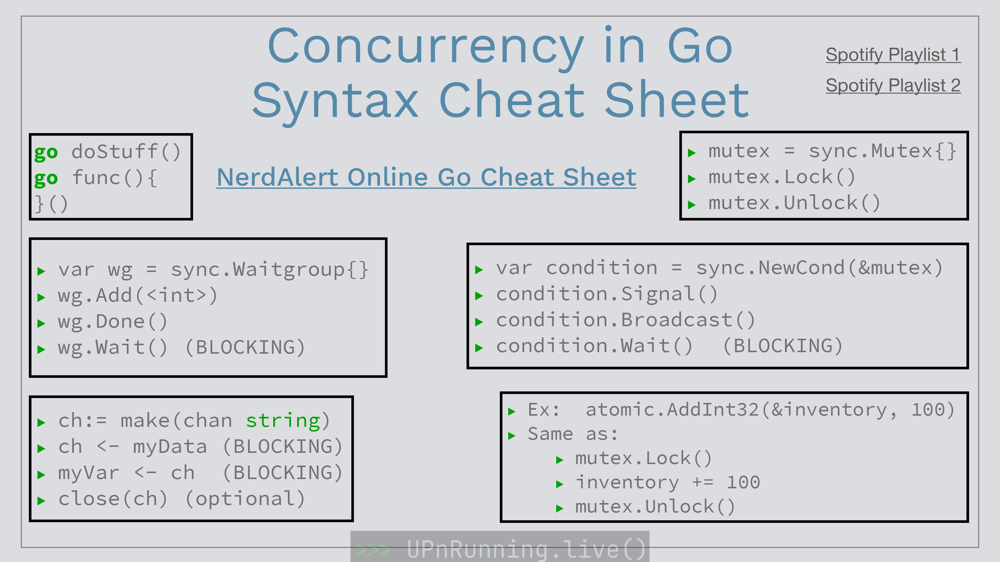

<!-- PROJECT LOGO -->
<br />
<div align="center">

  <h3 align="center">Concurrency in golang</h3>

  <p align="center">
    Resume for concurrency in golang
    <br />
    <a href="https://gist.github.com/nerdalert/9422fe6fba9d89dfe6b6#file-golang-cheatsheet-md"><strong>Explore the docs »</strong></a>
    <br />
</div>
<details>
  <summary>Table of Contents</summary>
  <ol>
    <li><a href="#intro">Intro</a></li>
    <li><a href="#gorutines">Goroutines</a></li>
    <li><a href="#channels">Channels</a></li>
    <li><a href="#waitgroups">WaitGroup</a></li>
    <li><a href="#mutex">Mutex</a></li>
    <li><a href="#synccond">Sync.Cond</a></li>
    <li><a href="#atomic">Atomic</a></li>
  </ol>
</details>

## Intro
Concurrency in Go allows you to run multiple tasks at the same time, which improves the performance and scalability of your applications. It is a powerful tool, but also complex, and requires a good understanding to use it correctly.
Keywords:

* go: Creates a new goroutine.
* func: Defines a function.
* make(chan T): Creates a channel of type T.
* chan T: Defines a channel of type T.
* <-chan T: Receives a value from the channel T.
* chan<-T: Sends a value to the channel T.
* WaitGroup: Synchronizes the completion of goroutines.
* Mutex: Protects access to shared data.
* Sync.Cond: Synchronizes access to shared data with conditions.
* Atomic: Atomic operations on variables.

<br>
<br>
<br>


## Goroutines
_Goroutines are functions that run in parallel. They are lightweight and efficient, making them ideal for tasks that do not need to block resources for a long time._


```Go
func main() {
  // Creates a new goroutine
  go func() {
    fmt.Println("Hello from a go routine")
  }()

  // Waits for the goroutine to finish
  fmt.Println("Waiting...")
  time.Sleep(1 * time.Second)
  fmt.Println("Done!")
}
```

## Channels
_Channels are a way of communication between goroutines. They allow you to send and receive data safely and efficiently._

### Keywords:

* ``make(chan T)``: Creates a channel of type T.
* ``chan T``: Defines a channel of type T.
* ``<-chan T``: Receives a value from the channel T.
* ``chan<-T``: Sends a value to the channel T.

### Example:

```Go
func main() {
  // Creates a channel of integers
  canal := make(chan int)

  // Creates a goroutine that sends a value to the channel
  go func() {
    canal <- 10
  }()

  // Receives the value from the channel
  valor := <-canal

  fmt.Println("The value received is", valor)
}
```

## WaitGroup
_WaitGroup is a tool to synchronize the completion of goroutines. It is used to wait for all goroutines in a group to finish before continuing._

### Keywords:

* ``WaitGroup``: Synchronizes the completion of goroutines.
* ``wg.Add(n)``: Increments the WaitGroup counter by n.
* ``wg.Done()``: Decrements the WaitGroup counter by 1.
* ``wg.Wait()``: Waits for the WaitGroup counter to reach 0.
Example:

```Go
func main() {
  // Creates a WaitGroup
  var wg WaitGroup

  // Creates two goroutines that increment the WaitGroup counter
  for i := 0; i < 2; i++ {
    go func() {
      wg.Add(1)
      fmt.Println("Goroutine", i, "started")
      time.Sleep(1 * time.Second)
      fmt.Println("Goroutine", i, "finished")
      wg.Done()
    }()
  }

  // Waits for the goroutines to finish
  wg.Wait()

  fmt.Println("All goroutines have finished!")
}
```

## Mutex
_Mutex is a type of lock that protects access to shared data. It is used to prevent two goroutines from modifying the same data at the same time, which can cause errors._

Keywords:

* ``Mutex``: Protects access to shared data.
* ``mutex.Lock()``: Locks the mutex.
* ``mutex.Unlock()``: Unlocks the mutex.
Example:

```Go
func main() {
  // Creates a mutex
  var mutex Mutex

  // Creates two goroutines that increment a shared variable
  for i := 0; i < 2; i++ {
    go func() {
      mutex.Lock()
      fmt.Println("Goroutine", i, "started")
      counter++
      fmt.Println("Goroutine", i, "finished")
      mutex.Unlock()
    }()
  }

  // Waits for the goroutines to finish
  time.Sleep(2 * time.Second)

  fmt.Println("The
```